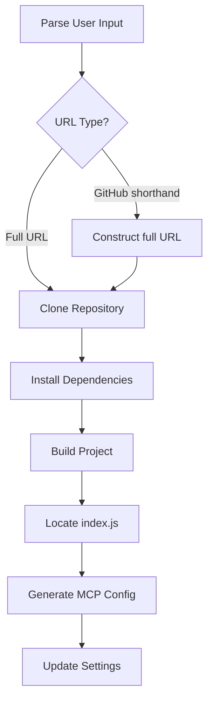

# MCP Easy Installer
MCP easy installer is a robust mcp server with tools to search, install, configure, repair and uninstall MCP servers.

## Install & Repair Tools for MCP servers

MCP easy installer is a robust tool to search, install, configure, repair and uninstall MCP servers (Model Context Protocol). This utility is designed for developers and non-developers and end users, making it easy to set up and maintain MCP servers without technical expertise. Developers and system integrators can also use it to speed up their workflow and automate repetitive tasks. The tool streamlines setup, automates repairs, and ensures your MCP environment is always healthy.
This tool will automatically install and update all the necessary JSON configuration files for a wide range of applications, including Claude Desktop, Windsurf, Cursor, Roo Code, Cline, *GitHub Copilot, and more. It ensures seamless integration and up-to-date settings across your AI and developer tools ecosystem. 

---

## Features

- **Search & Discovery:** Find available MCP servers for installation.
- **Automated Installation:** Quickly install MCP servers from GitHub or local sources.
- **Repair Utility:** Detects and fixes common MCP server issues.
- **TypeScript Support:** Built with TypeScript for reliability and maintainability.
- **Comprehensive Logging:** Clear logs for every operation.
- **Cross-Platform:** Works on Windows, Linux, and Mac.

---

## Important Installation Note

**MCP easy intaller do not use `npx` to install MCP servers with Node.js.**  
Instead, it manually install all MCP servers in the following directory:

- **Windows:**
  ```
  C:\Users\USERNAME\Documents\Flowvibe\MCP\
  ```
- **Linux/Mac:**
  ```
  /home/USERNAME/Documents\Flowvibe\MCP/
  ```

Replace `USERNAME` with your actual user name on your system.

---

## VS Code - GitHub Copilot Integration Notes

**GitHub Copilot for VS Code is not directly supported by this tool.**

GitHub Copilot implements MCP in its own way with significant differences from other implementations. Due to these differences, GitHub Copilot is not included in this tool's supported applications.

* **Workaround:**
If you want to update MCP server connections for VS Code GitHub Copilot, install Claude Desktop, as GitHub Copilot connects to Claude Desktop's MCP servers. This provides an indirect way to enhance GitHub Copilot's capabilities through MCP.

---

## Python Integration Notes

**Python integration with MCP has some limitations.**

While this tool aims to provide seamless integration across multiple platforms and languages, Python support is currently imperfect and may require manual intervention in certain scenarios. Due to the diversity of Python environments, package managers, and project structures, automated installation and configuration may not work optimally in all cases.

**We welcome community contributions:**
- If you encounter issues with Python integration, please share your solutions in the issues section
- Consider forking this repository to implement improvements specific to Python environments
- Pull requests with enhancements to Python support are greatly appreciated

Our goal is to improve Python integration through collaborative development and user feedback.

---

## Installation

Clone the repository and install dependencies:

### Option 1: Install with Git

```bash
# Clone the repository
git clone https://github.com/onigetoc/mcp-easy-installer.git

# Navigate to the directory
cd mcp-easy-installer

# Install dependencies
npm install

# Build the project
npm run build
```

### Option 2: Download and Install

1. Download the latest release from https://github.com/onigetoc/mcp-easy-installer
2. Extract the files to your preferred location
3. Open a terminal in the extracted directory
4. Run `npm install` to install dependencies
5. Run `npm run build` to compile the application for use with MCP clients

---

## Configuration

Configure your MCP servers in your settings file (The Github token is optional to search mcp server: Prevents rate limiting):

By default, the tool searches for repositories in TypeScript (ts), JavaScript (js), and HTML. You can customize this or add other languages (like Python 'py' or Shell 'sh') using the `--langcode` argument. For example, to search also for Python and Shell repositories, you would add `"--langcode=ts,js,html,py,sh"` to the `args` list below. For the easiest setup, it's recommended to omit the `--langcode` argument to use the defaults.


```json
{
  "mcpServers": {
    "mcp-easy-installer": {
      "command": "node",
      "args": [
        "path-to\\mcp-easy-installer\\build\\index.js"
      ],
      "env": {
        "GITHUB_TOKEN": "your_github_token"
      }
    }
  }
}
```

### Example: Configuration with all supported languages

If you want to customize the languages used for searching, here's an example of the `args` array that includes all supported language codes. withour this line, default are javascript, typescript and html:

```json
"args": [
  "path-to\\mcp-easy-installer\\build\\index.js",
  "--langcode=ts,js,html,py,sh"
]

// this will also work
"--langcode=typescript,javascript,HTML,python,shell" // Your can add more according to the Github search filter
```

Get your personal [GitHub Token](https://github.com/settings/tokens) then click Generate new token (You may have to login or create a Githhub account before).

---

#### Example Phrases
#### Community Question: GitHub Search Integration

We are considering whether to integrate a GitHub search feature directly into this tool. If integrated, providing a GitHub API token could be optional—without it, the Github search feature will not work (or may be restricted and limited), but all other tools and features will continue to function normally.

**We invite feedback from the community:**
Would you like to see GitHub search built in? Please share your thoughts and use cases in the issues or discussions section of this repository.


You can use natural language commands like:

- `Search for the fetch mcp server. (follow up prompt: install the third one)` May work with Brave or any others search tools with the Github or npmjs link.
- `Search Github mcp server "wikipedia server"`
- `Install this mcp server: https://www.npmjs.com/package/@modelcontextprotocol/server-brave-search` (NPMjs or Github repo url) or use Install <package>
- `Install this mcp server tavily-ai/tavily-mcp` Install <package>
- `Install mcp server with a Brave Github link search result.`
- `Repair the brave mcp server.`
- `Update all installed mcp servers.` Not working yet
- `Uninstall Brave` Will work and find it even if the name is "server-brave-search"

Note: Depending on LLM and the tool functions, it is perhaps preferable to often use these two words to trigger the MCP. Install, repair, fix, search `mcp servers.`

---

## Platform Testing

This tool has been primarily developed and tested on Windows to fix problematic NPX installation . While it's designed to be cross-platform, we have limited ability to test on all operating systems.

**Mac and Linux Testing:**
We need feedback from Mac and Linux users to ensure compatibility across all platforms. If you're using this tool on macOS or Linux distributions:

- Please report any issues you encounter in the [GitHub Issues](https://github.com/onigetoc/mcp-easy-installer/issues)
- Specify your operating system version and environment details
- Suggestions for platform-specific improvements are welcome
- Consider contributing platform-specific fixes if you have the expertise

Your feedback is invaluable in making this tool work seamlessly across all operating systems.

## Optimized MCP Server Usage with LLMs

Through extensive testing with various MCP servers, we've discovered an optimal approach for LLMs to interact with MCP servers, even for smaller models using Function calls. Here's the recommended context to add to your MCP client for better results:

```text
Every time you use a MCP server (Model Context Protocol), you must give the complete information. If, for example, you are asked to do a search on anything (YouTube, Wikipedia, Internet, BRAVE, etc.), you must give as much information as possible on the title, description and links. The links are very important in the answer because it can be used later in the conversation, for follow-up interactions with the MCP Client or others MCP servers.

At the beginning of each answer but only if it's a complex question, make a bullet list to summarize what you are going to do between 5 and 10 points of what you will do next.

After your answer, if it's a complex question, always write a resume and a plan to follow at the end of the answer.

Use MCP server tools to go deeper when it's a structured work to do according the the complexity of the task.

For example, if the user asks something very simple like, "hello, how are you?" You don't have to do deep research and just answer normally, without task, without going deeper. Just answer directly.
```

For a complete example of this implementation, see this [Github Gist](https://gist.github.com/onigetoc/d600d49ef5fbcc8d2942662e703a9dd6).

[](https://twitter.com/intelixai_com)

---

## Installation Flow



---

## Contributing

1. Fork the repository.
2. Create a new branch.
3. Make your changes.
4. Submit a pull request.
5. Or only send suggestions and help from issues section.

---

## License

MIT