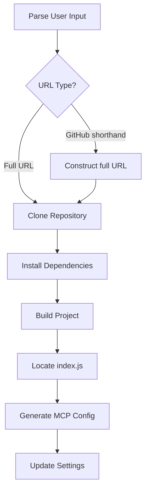

# MCP Install & Repair Tool

A robust tool to search, install, configure, repair and uninstall MCP servers (Model Context Protocol). This utility is designed for developers and non-developers and end users, making it easy to set up and maintain MCP servers without technical expertise. Developers and system integrators can also use it to speed up their workflow and automate repetitive tasks. The tool streamlines setup, automates repairs, and ensures your MCP environment is always healthy.
This tool will automatically install and update all the necessary JSON configuration files for a wide range of applications, including Claude Desktop, Windsurf, Cursor, Roo Code, Cline Copilot, GitHub Copilot, and more. It ensures seamless integration and up-to-date settings across your AI and developer tools ecosystem.


---

## Features

- **Search & Discovery:** Find available MCP servers for installation.
- **Automated Installation:** Quickly install MCP servers from GitHub or local sources.
- **Repair Utility:** Detects and fixes common MCP server issues.
- **TypeScript Support:** Built with TypeScript for reliability and maintainability.
- **Comprehensive Logging:** Clear logs for every operation.
- **Cross-Platform:** Works on Windows, Linux, and Mac.

---

## Important Installation Note

**Do NOT use `npx` to install MCP servers with Node.js.**  
Instead, manually install all MCP servers in the following directory:

- **Windows:**
  ```
  C:\Users\USERNAME\Documents\Flowvibe\MCP\
  ```
- **Linux/Mac:**
  ```
  /home/USERNAME/Documents/Flowvibe/MCP/
  ```

Replace `USERNAME` with your actual user name on your system.

---

## Installation

Clone the repository and install dependencies:

```bash
git clone https://github.com/your-org/mcp-install-repair-tool.git
cd mcp-install-repair-tool
npm install
```

#### Example Phrases
#### Community Question: GitHub Search Integration

We are considering whether to integrate a GitHub search feature directly into this tool. If integrated, providing a GitHub API token would be optional—without it, the search feature will not work, but all other tools and features will continue to function normally.

**We invite feedback from the community:**
Would you like to see GitHub search built in? Please share your thoughts and use cases in the issues or discussions section of this repository.


You can use natural language commands like:

- `Search for the fetch mcp server. (follow up prompt: install the third one)` May work with Brave or any others search tools with the Github or npmjs link.
- `Install this mcp server: https://www.npmjs.com/package/@modelcontextprotocol/server-brave-search` (NPMjs or Github repo url)
- `Install this mcp server tavily-ai/tavily-mcp` 
- `Install mcp server with a Brave github link.`
- `Repair the brave mcp server.`
- `Update all installed mcp servers.` Not working yet
- `Uninstall Brave` Will work and find it even if the name is "server-brave-search"

Note: Depending on LLM and the tool functions, it is perhaps preferable to often use these two words to trigger the MCP. Install, repair, fix, search `mcp servers.`

---

## Usage

### Build the project

```bash
npm run build
```

### Start the tool

```bash
npm start install <MCP_SERVER_GITHUB_URL>
```

Example:

```bash
npm start install https://github.com/overstarry/qweather-mcp
```

---

## Configuration

Configure your MCP servers in your settings file (example):

```json
{
  "mcpServers": {
    "my-server": {
      "command": "node",
      "args": ["C:\\Users\\USERNAME\\Documents\\Flowvibe\\MCP\\my-server\\build\\index.js"],
      "env": {
        "GITHUB_TOKEN": "your_github_token"
      },
      "enable": true,
      "disabled": false,
      "autoApprove": []
    }
  }
}
```

---

## Example MCP Server Bin Paths

- **Windows:**
  ```
  C:\Users\USERNAME\Documents\Flowvibe\MCP\server-fileserver\dist\index.js
  ```
- **Linux/Mac:**
  ```
  /home/USERNAME/Documents/Flowvibe/MCP/server-fileserver/dist/index.js
  ```

---

## Installation Flow



---

## Contributing

1. Fork the repository.
2. Create a new branch.
3. Make your changes.
4. Submit a pull request.

---

## License

MIT