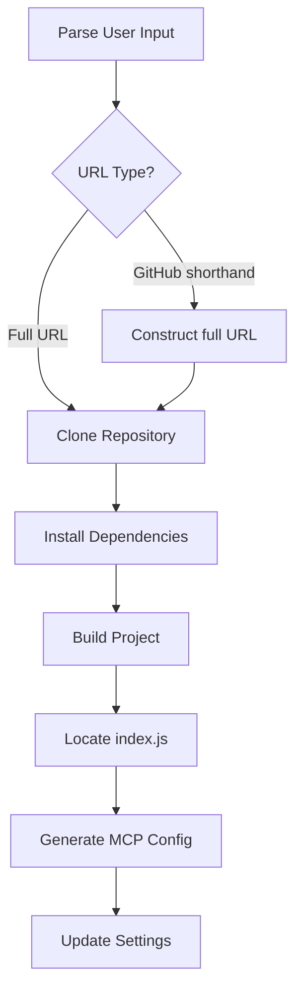

# MCP Server Installer Tool Plan

This plan outlines the steps to add a new installer tool to the MCP server repair tool.

## Problem Solved
The tool will allow users to install new MCP servers directly from GitHub repositories, handling various URL formats and avoiding NPX issues on Windows.

## Installation Flow

## Key Components

### Reusable Components:
- `getMcpBasePath()`: Determine the installation directory within the `Cline/MCP` folder.
- `verifyPackageJson()`: Check `package.json` for build scripts and dependencies.
- `findJsFile()`: Locate the compiled `index.js` file after the build process.
- `generateMcpConfig()`: Create the necessary configuration entry for `cline_mcp_settings.json`.

### New Components:
- **URL Parser:** Handle different GitHub URL formats:
    - `executeautomation/mcp-playwright`
    - `https://github.com/executeautomation/mcp-playwright.git`
    - `https://github.com/executeautomation/mcp-playwright`
    - Convert shorthand to a full cloneable URL.
- **Git Clone Functionality:** Use `child_process.execSync` to execute `git clone`.
- **Installation Workflow Manager:** Orchestrate the steps: clone, install dependencies (`npm install`), build (`npm run build`), find JS file, generate config.
- **Error Handling:** Provide clear messages for Git errors, build failures, or missing files.
- **Settings Update:** Guide the user on how to add the generated configuration to their settings file.

## Implementation Notes
- Installation target directory: `[MCP Base Path]/[repository name]`
- Avoid NPX for installation steps; rely on `node` and direct script paths.
- Reuse existing logging for debugging.